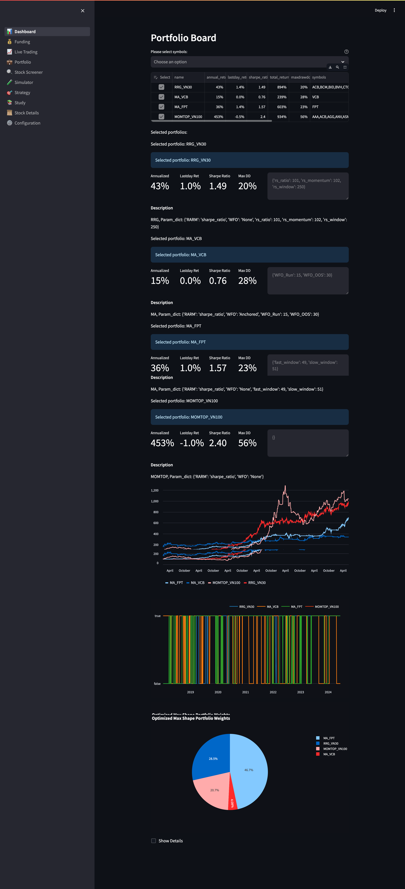
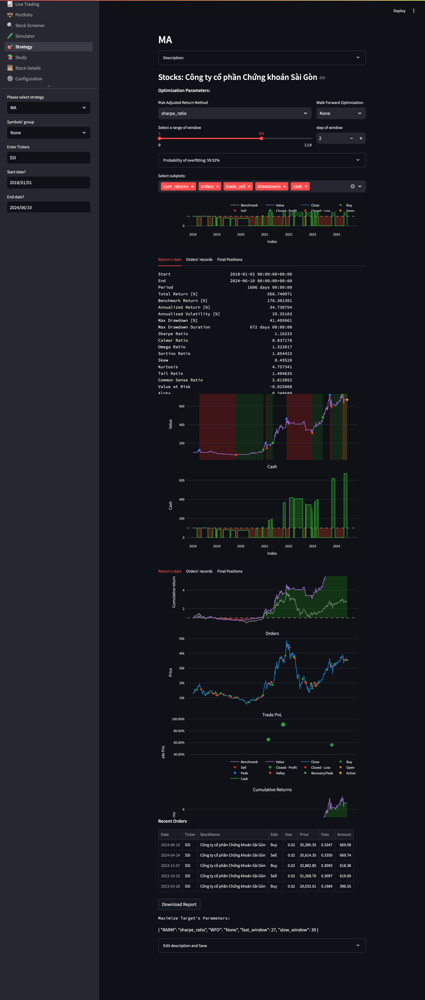
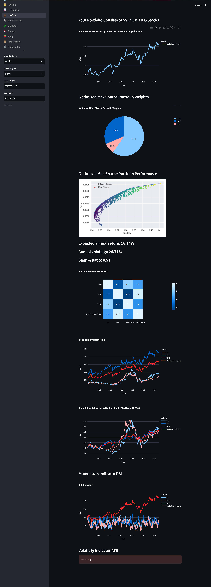
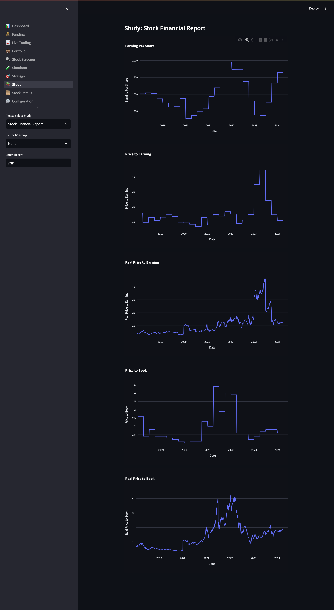

# BeQuant Overview

BeQuant is a platform that allows you to create, backtest, and deploy trading strategies. It provides a simple and intuitive interface to create strategies, backtest them, and deploy them to the market.

### Workflow
**1. Find an idea:** Find an idea for a trading strategy. This could be a simple moving average crossover strategy, a mean reversion strategy, or a momentum strategy.

**2. Fetch data:** Fetch historical data for the assets you want to trade. BeQuant provides a data fetcher that allows you to fetch data from various sources.

**2. Study the data:** Study the data to understand the behavior of the assets you want to trade. This will help you to create a strategy that is profitable.

**3. Create a strategy:** Create a trading strategy using the strategy editor. The strategy editor allows you to create a strategy using a simple and intuitive interface.

**4. Analyze the strategy:** Analyze the strategy to see how it performs on historical data. This will help you to understand the performance of the strategy and make any necessary adjustments.

**5. Deploy the strategy:** Deploy the strategy to the market. BeQuant provides a deployment tool that allows you to deploy the strategy to the market with a single click.

**6. Allocate the portfolio:** Allocate the portfolio to the strategy. BeQuant provides a portfolio allocation tool that allows you to allocate the portfolio to the strategy with a single click.

**7. Live trading:** Monitor the performance of the strategy in real-time. BeQuant provides a dashboard that allows you to monitor the performance of the strategy in real-time.

# Dasboard

The dashboard is the first page you see when you log in to BeQuant. It provides a quick overview of the deployed strategies.

# Strategy

The strategy page provides a detailed view of the strategy. It shows the strategy's performance, the trades it has made, and the current positions.

# Portfolio

The portfolio page provides a detailed view of the portfolio. It shows the optimal portfolio allocation, the current portfolio allocation, and the current allocation of the assets in the portfolio.

# Studies

The studies page provides a detailed view of the studies. It shows the performance of the studies, the trades they have made, and the current positions.

